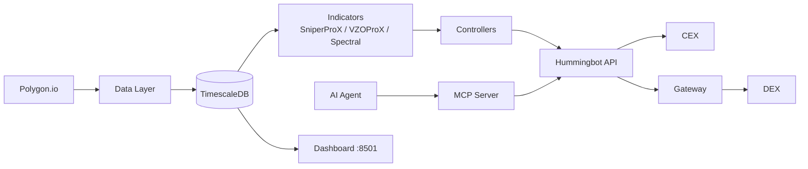

# UpTrade -- AI-Powered Crypto Trading Platform

UpTrade combines **VectorBT Pro** analytics with **Hummingbot** execution to deliver an automated, AI-driven crypto trading system. Numba-compiled indicators (SniperProX, VZOProX, Spectral Analysis) generate signals from Polygon.io market data stored in TimescaleDB, which drive bot deployments on both centralized and decentralized exchanges. An MCP interface lets AI agents deploy bots, run backtests, and analyze market cycles through natural language.

## Key Features

- **SniperProX Indicator** -- Fisher-transform oscillator with adaptive MA, DMI/ADX filtering, and volume confirmation
- **VZOProX Indicator** -- Volume Zone Oscillator with noise filtering and adaptive zone signals
- **Spectral Analysis** -- Multi-cycle detection via Hurst Bandpass Filter and Goertzel DFT (11 cycle periods, 5-day to 18-year)
- **Universal MA Library** -- 34 moving average types compiled to native code via Numba
- **Multi-Exchange Execution** -- Binance, OKX, Bybit (CEX) and Uniswap, Jupiter, Hyperliquid, dYdX (DEX via Gateway)
- **MCP Integration** -- AI agent interface for natural-language bot management and analysis
- **Real-Time Dashboard** -- Streamlit UI with bot monitoring, signal visualization, and cycle analysis

## Quick Start

```bash
# 1. Clone and configure
git clone https://github.com/Obsidian8Capital/uptrade.git
cd uptrade
cp docker/.env.example docker/.env
# Edit docker/.env with your Polygon API key and Hummingbot password

# 2. Start services
cd docker && docker compose up -d && cd ..

# 3. Launch dashboard
pip install -e ".[dashboard]"
streamlit run src/dashboard/app.py
```

## Architecture



## Documentation

| Document | Description |
|----------|-------------|
| [Deployment Guide](docs/deployment.md) | Setup, configuration, and troubleshooting |
| [MCP Workflows](docs/mcp-workflows.md) | AI agent workflow examples and MCP tool reference |
| [Indicator Reference](docs/indicators.md) | Full parameter and signal documentation for all indicators |
| [Architecture](docs/architecture.md) | System design, data flow, and database schema |

## Project Structure

```
uptrade/
├── docker/
│   ├── docker-compose.yml      # TimescaleDB, Hummingbot API/Gateway/MCP
│   ├── .env.example            # Environment variable template
│   └── init.sql                # Database schema and hypertables
├── src/
│   ├── config/
│   │   ├── settings.py         # Pydantic environment settings
│   │   ├── bot_config.py       # YAML bot deployment config models
│   │   ├── deployer.py         # Hummingbot V2 REST API client
│   │   ├── gateway_config.py   # DEX gateway client
│   │   └── examples/           # Sample bot YAML configs
│   ├── data/
│   │   ├── polygon_client.py   # Polygon.io data ingestion via VBT
│   │   ├── tsdb.py             # TimescaleDB read/write operations
│   │   ├── updater.py          # Continuous data polling service
│   │   └── db.py               # Database connection management
│   ├── indicators/
│   │   ├── sniper.py           # SniperProX indicator
│   │   ├── vzo.py              # VZOProX indicator
│   │   ├── spectral.py         # Spectral Analysis indicator
│   │   ├── ma_library.py       # Universal MA (34 types)
│   │   ├── mtf_cycles.py       # Multi-timeframe cycle detector
│   │   ├── astro_lib.py        # Planetary position calculations
│   │   ├── celestial_channels.py # Celestial price-level channels
│   │   ├── signals.py          # Entry/exit signal generation
│   │   ├── backtest.py         # VBT Portfolio backtesting
│   │   ├── optimize.py         # Grid-search optimization
│   │   └── nb/                 # Numba-compiled kernels
│   ├── signals/
│   │   └── combiner.py         # Multi-indicator signal combiner
│   ├── controllers/
│   │   ├── base_vbt_controller.py  # Hummingbot V2 controller base
│   │   ├── sniper_controller.py    # SniperProX controller
│   │   ├── vzo_controller.py       # VZOProX controller
│   │   └── cycle_controller.py     # Spectral cycle controller
│   └── dashboard/
│       ├── app.py              # Streamlit entry point
│       ├── pages/              # Bot Overview, Signals, Cycles pages
│       └── components/         # Reusable chart and card components
├── scripts/
│   ├── deploy_bot.py           # CLI bot deployment tool
│   ├── run_updater.py          # Start data updater service
│   └── setup_gateway.py        # Gateway wallet setup
├── tests/                      # pytest test suite
├── docs/                       # Documentation
├── .mcp.json                   # MCP server configuration
└── pyproject.toml              # Project metadata and dependencies
```

## Tech Stack

| Component | Technology |
|-----------|-----------|
| Analytics | VectorBT Pro |
| Computation | Numba (JIT) |
| Database | TimescaleDB (PostgreSQL 16) |
| Market Data | Polygon.io |
| Execution | Hummingbot V2 |
| DEX Access | Hummingbot Gateway |
| AI Interface | MCP (Model Context Protocol) |
| Dashboard | Streamlit + Plotly |
| Language | Python 3.10+ |

## License

MIT
