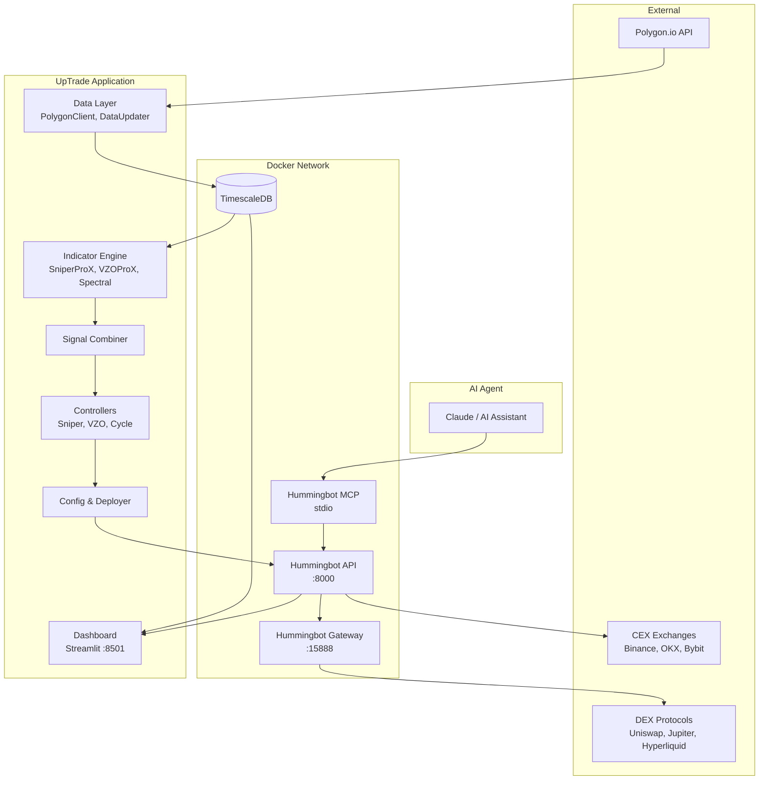
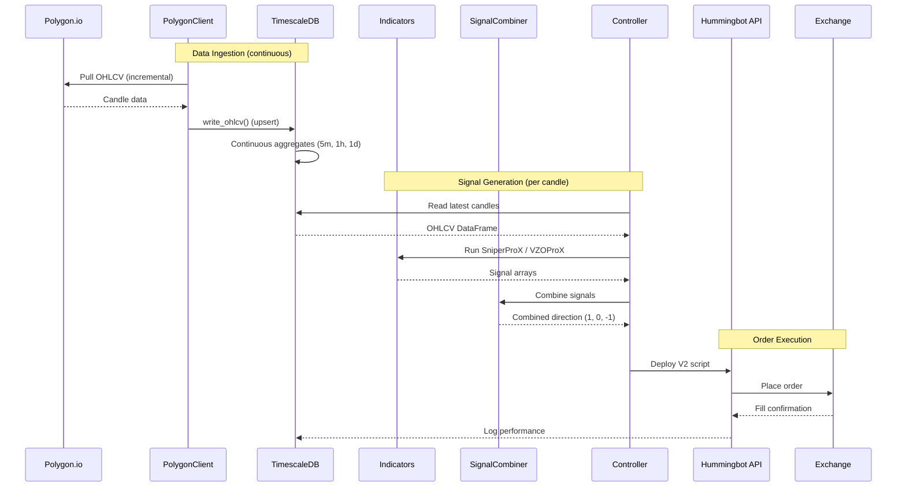
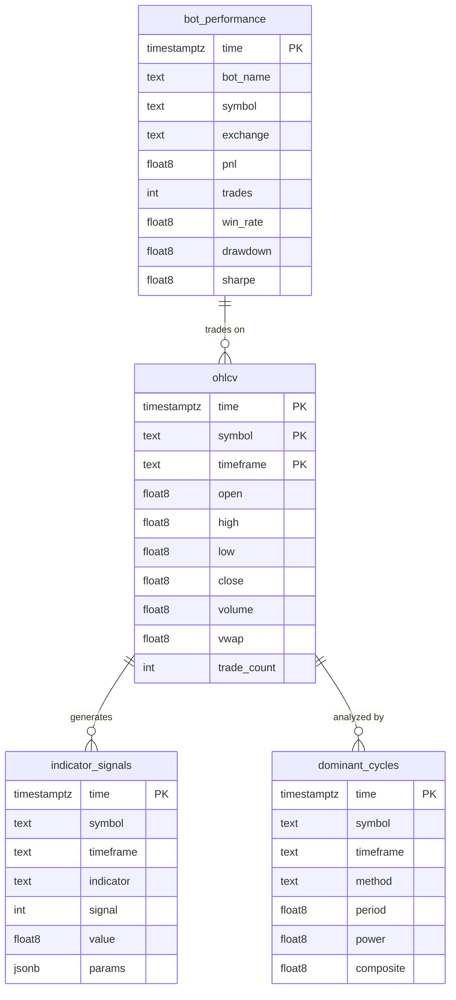
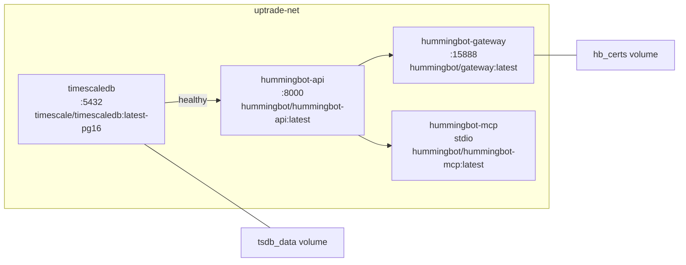

# System Architecture

## System Overview

UpTrade is an AI-powered crypto trading platform that combines VectorBT Pro analytics with Hummingbot execution. Data flows from Polygon.io into TimescaleDB, gets processed by Numba-compiled indicators, and drives automated bot deployments on CEX and DEX venues.

---

## Data Flow

---

## Component Architecture

### Data Layer (`src/data/`)

| Module | Responsibility |
|--------|---------------|
| `polygon_client.py` | Fetches OHLCV data from Polygon.io via VBT Pro's `PolygonData` |
| `tsdb.py` | TimescaleDB read/write operations (SQLAlchemy) |
| `updater.py` | Continuous polling service with per-timeframe intervals |
| `db.py` | Database connection and session management |

The `DataUpdaterService` runs one async task per symbol/timeframe pair, polling at 80% of the candle duration. On startup, it performs an incremental backfill to fill any gaps.

### Indicator Engine (`src/indicators/`)

| Module | Description |
|--------|-------------|
| `sniper.py` | SniperProX (Fisher transform + DMI/ADX + adaptive zones) |
| `vzo.py` | VZOProX (Volume Zone Oscillator + noise filter) |
| `spectral.py` | Spectral Analysis (Hurst bandpass / Goertzel DFT) |
| `ma_library.py` | Universal MA wrapper (34 types) |
| `mtf_cycles.py` | Multi-timeframe cycle detector |
| `astro_lib.py` | Planetary position calculations |
| `celestial_channels.py` | Planetary longitude to price levels |
| `signals.py` | Simple entry/exit signal generation |
| `backtest.py` | VBT Portfolio backtesting pipeline |
| `optimize.py` | Grid-search parameter optimization |
| `nb/` | Numba-compiled kernels (sniper_nb, vzo_nb, spectral_nb, ma_library_nb, astro_nb) |

All heavy computation lives in `nb/` as `@njit` functions. The parent modules provide VBT `IndicatorFactory` wrappers for pandas/numpy interop.

### Controllers (`src/controllers/`)

| Module | Controller Type | Indicator |
|--------|----------------|-----------|
| `base_vbt_controller.py` | `vbt_base` | Abstract base with data pipeline |
| `sniper_controller.py` | `vbt_sniper` | SniperProX |
| `vzo_controller.py` | `vbt_vzo` | VZOProX |
| `cycle_controller.py` | `vbt_cycle` | SpectralAnalysis |

Controllers implement the Hummingbot V2 `DirectionalTrading` interface. Each controller:
1. Receives candle data from the market data provider
2. Runs its indicator through the Numba-compiled kernel
3. Returns a signal: `1` (long), `-1` (short), `0` (neutral)

### Dashboard (`src/dashboard/`)

| Module | Page | Description |
|--------|------|-------------|
| `app.py` | Home | Landing page with sidebar controls |
| `pages/01_bot_overview.py` | Bot Overview | Live bot statuses, P&L summary |
| `pages/02_signals.py` | Signals | OHLCV charts with indicator overlays |
| `pages/03_cycles.py` | Cycles | Spectral analysis visualization |
| `components/bot_cards.py` | — | Reusable bot status card components |
| `components/charts.py` | — | Plotly chart builders |

### Configuration (`src/config/`)

| Module | Purpose |
|--------|---------|
| `settings.py` | Pydantic settings from environment variables |
| `bot_config.py` | YAML bot deployment config models |
| `deployer.py` | Async HTTP client for Hummingbot V2 REST API |
| `gateway_config.py` | Gateway DEX connector client |
| `examples/` | Sample YAML configs for different strategies |

---

## Database Schema

All four tables are TimescaleDB hypertables with automatic partitioning on the `time` column. Continuous aggregates roll up `ohlcv` from 1m to 5m, 1h, and 1d. The `ohlcv` table has a compression policy that compresses chunks older than 7 days.

---

## Docker Service Map

**Dependency chain:** `timescaledb` (healthy) -> `hummingbot-api` -> `hummingbot-gateway`, `hummingbot-mcp`

All services use `restart: unless-stopped` and are connected to the `uptrade-net` bridge network.

---

## Technology Stack

| Layer | Technology | Version | Purpose |
|-------|-----------|---------|---------|
| **Analytics** | VectorBT Pro | Latest | Portfolio backtesting, indicator framework |
| **Computation** | Numba | 0.59+ | JIT-compiled indicator kernels |
| **Data** | NumPy / Pandas | 1.24+ / 2.0+ | Array and DataFrame operations |
| **Database** | TimescaleDB | PG16 | Time-series storage with hypertables |
| **ORM** | SQLAlchemy | 2.0+ | Database access layer |
| **Market Data** | Polygon.io | API v2 | Historical + real-time crypto OHLCV |
| **Execution** | Hummingbot | V2 API | Bot orchestration, order management |
| **DEX Access** | Hummingbot Gateway | Latest | Multi-chain DEX connector |
| **AI Interface** | Hummingbot MCP | Latest | Model Context Protocol server |
| **Dashboard** | Streamlit | 1.30+ | Web monitoring UI |
| **Charts** | Plotly | 5.18+ | Interactive candlestick and signal charts |
| **Config** | Pydantic | 2.0+ | Settings and config validation |
| **HTTP Client** | httpx | 0.25+ | Async API client |
| **Language** | Python | 3.10+ | Application language |
| **Containers** | Docker Compose | v2+ | Service orchestration |
