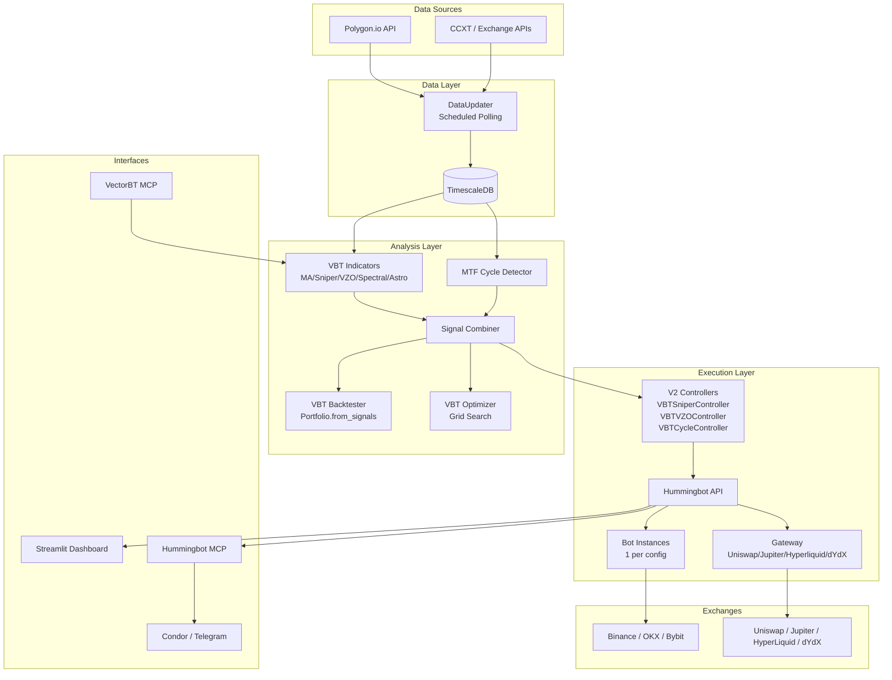

# PRD-001: UpTrade — AI-Powered Crypto Trading Platform

**Version:** 1.0
**Author:** Conductor (Claude Opus 4.5)
**Date:** 2026-01-30
**Project:** UpTrade
**Repo:** https://github.com/Obsidian8Capital/uptrade
**Archon ID:** 1f388bdf-f1d7-4d86-8f76-95c2d950efa3

---

## Vision

UpTrade is a self-contained crypto trading system that connects **VectorBT Pro's analytical engine** (custom Numba-accelerated indicators, backtesting, optimization) to **Hummingbot's execution engine** (multi-exchange bot deployment on CEX and DEX), backed by **TimescaleDB** for persistent market data and **Polygon.io** for real-time feeds. The entire system is orchestrable via **MCP** — meaning an AI agent can research, backtest, deploy, monitor, and iterate trading strategies through natural language.

**Success looks like:** A user says "Deploy SniperProX on BTC-USDT perpetuals on Binance with 28-bar length, Jurik MA" and the system backtests the params, deploys a Hummingbot bot, and starts trading — with live P&L visible in a dashboard.

---

## Goals

- [ ] **G1:** Persistent crypto market data pipeline (Polygon.io → TimescaleDB) with multi-timeframe continuous aggregates
- [ ] **G2:** Custom VBT Pro indicators (34 MA types, SniperProX, VZOProX, SpectralAnalysis, AstroLib, CelestialChannels) integrated as signal sources
- [ ] **G3:** Hummingbot V2 Controllers that consume VBT indicator signals for directional trading
- [ ] **G4:** Granular bot deployment — any indicator × any pair × any exchange × any timeframe
- [ ] **G5:** DEX support via Hummingbot Gateway (Uniswap, Jupiter, Hyperliquid, dYdX)
- [ ] **G6:** Multi-timeframe dominant cycle detection feeding adaptive indicator parameters
- [ ] **G7:** Dashboard for monitoring bots, signals, cycles, and P&L
- [ ] **G8:** Docker Compose one-command deployment of the full stack
- [ ] **G9:** MCP integration enabling AI agents to orchestrate the entire platform

---

## Epics & User Stories

### Epic 1: Data Infrastructure
- **US-1.1:** As a trader, I want OHLCV data for crypto pairs stored in TimescaleDB so that I have fast, persistent access to market history.
  - Acceptance: Docker TimescaleDB with hypertables, continuous aggregates for 1m→5m→1h→1d rollups
- **US-1.2:** As a trader, I want Polygon.io data ingestion so that I get reliable market data with VWAP and trade count.
  - Acceptance: `vbt.PolygonData.pull("X:BTCUSD")` → TimescaleDB via `vbt.SQLData`
- **US-1.3:** As a trader, I want scheduled data updates so that my database stays current without manual intervention.
  - Acceptance: `DataUpdater.update_every(60)` polling loop with configurable intervals per symbol/timeframe

### Epic 2: Indicator Engine
- **US-2.1:** As a trader, I want all 34 MA types plus SniperProX, VZOProX, SpectralAnalysis available in UpTrade so I can combine them for signals.
  - Acceptance: Port existing `Pinescript/vbt/` code into `src/indicators/` with clean imports
- **US-2.2:** As a trader, I want multi-timeframe cycle detection so that I can identify dominant market cycles and use them as adaptive indicator lengths.
  - Acceptance: `MTFCycleDetector.run(symbol, timeframes=["5m","1h","4h","1d"])` returns dominant cycle periods per timeframe
- **US-2.3:** As a trader, I want a signal combiner that merges multiple indicator outputs into actionable buy/sell decisions.
  - Acceptance: Configurable AND/OR/WEIGHTED logic combining Sniper + VZO + Spectral + custom conditions

### Epic 3: Hummingbot V2 Controller Bridge
- **US-3.1:** As a trader, I want VBT indicators to drive Hummingbot directional trading bots so that my signals execute real trades.
  - Acceptance: Custom `DirectionalTradingController` subclass that calls VBT indicators in `update_processed_data()`
- **US-3.2:** As a trader, I want configurable controller configs (YAML) per indicator/pair/exchange so that I can deploy different strategies independently.
  - Acceptance: One YAML = one bot deployment with all params (indicator, pair, exchange, timeframe, risk params)
- **US-3.3:** As a trader, I want the controller to support both CEX and DEX execution venues.
  - Acceptance: Same indicator signal → Binance perps OR Uniswap spot via Gateway, selected by config

### Epic 4: Bot Deployment & Management
- **US-4.1:** As a trader, I want to deploy bots via Hummingbot API with specific indicator configurations.
  - Acceptance: `POST /bot-orchestration/deploy-v2-script` with VBT controller config
- **US-4.2:** As a trader, I want to start/stop/monitor bots via MCP so that AI agents can manage my portfolio.
  - Acceptance: Hummingbot MCP tools (`start_bot`, `stop_bot`, `get_bot_status`) work with our custom controllers
- **US-4.3:** As a trader, I want Gateway configured for DEX trading on Ethereum, Solana, and L2s.
  - Acceptance: Gateway container with Uniswap (ETH/Polygon/Arbitrum), Jupiter (Solana), Hyperliquid, dYdX connectors

### Epic 5: Dashboard & Monitoring
- **US-5.1:** As a trader, I want a dashboard showing live bot status, P&L, and active signals.
  - Acceptance: Streamlit dashboard with bot overview, per-bot P&L, signal chart
- **US-5.2:** As a trader, I want a dominant cycle heatmap across timeframes so I can see which cycles are active.
  - Acceptance: Heatmap showing cycle power per period per timeframe, updated on each candle close
- **US-5.3:** As a trader, I want signal visualization showing indicator outputs overlaid on price charts.
  - Acceptance: Chart with OHLCV + indicator overlays + buy/sell markers

### Epic 6: Docker & DevOps
- **US-6.1:** As a developer, I want a single `docker-compose up` to launch the entire stack.
  - Acceptance: TimescaleDB + Hummingbot API + Gateway + MCP + Dashboard all in one compose file
- **US-6.2:** As a developer, I want environment configuration via `.env` file for API keys, DB credentials, exchange credentials.
  - Acceptance: `.env.example` with all required variables documented
- **US-6.3:** As a developer, I want health checks and logging for all services.
  - Acceptance: Docker healthchecks, structured logging, error alerting

---

## Technical Architecture

### System Diagram



### Technology Decisions

| Component | Technology | Rationale |
|-----------|------------|-----------|
| Market data store | TimescaleDB (PostgreSQL) | Hypertables for time-series, continuous aggregates, SQL compatibility, VBT SQLData native support |
| Data feed | Polygon.io | Reliable crypto data with VWAP, trade count; VBT PolygonData built-in |
| Indicator engine | VectorBT Pro + Numba | @njit acceleration, IndicatorFactory pattern, backtesting/optimization built-in |
| Execution engine | Hummingbot V2 | Open-source, V2 Controller framework, multi-exchange, Gateway for DEX |
| DEX middleware | Hummingbot Gateway | Standardized DEX API across chains (EVM, Solana, Cosmos) |
| Dashboard | Streamlit | Fast prototyping, Python-native, works with pandas/plotly |
| Container orchestration | Docker Compose | Single-command deploy, service dependencies, health checks |
| AI orchestration | MCP (Model Context Protocol) | Hummingbot MCP + VectorBT MCP allow AI agents to control entire platform |
| Config format | YAML | Human-readable, Hummingbot-native config format |

### Data Schema

```sql
-- Core OHLCV hypertable
CREATE TABLE ohlcv (
    time        TIMESTAMPTZ NOT NULL,
    symbol      TEXT        NOT NULL,
    timeframe   TEXT        NOT NULL,
    open        DOUBLE PRECISION,
    high        DOUBLE PRECISION,
    low         DOUBLE PRECISION,
    close       DOUBLE PRECISION,
    volume      DOUBLE PRECISION,
    vwap        DOUBLE PRECISION,
    trade_count INTEGER
);
SELECT create_hypertable('ohlcv', 'time');

-- Indicator signal cache
CREATE TABLE indicator_signals (
    time        TIMESTAMPTZ NOT NULL,
    symbol      TEXT        NOT NULL,
    timeframe   TEXT        NOT NULL,
    indicator   TEXT        NOT NULL,
    signal      INTEGER,           -- -1, 0, 1
    value       DOUBLE PRECISION,  -- indicator raw value
    params      JSONB              -- indicator params snapshot
);
SELECT create_hypertable('indicator_signals', 'time');

-- Bot performance log
CREATE TABLE bot_performance (
    time        TIMESTAMPTZ NOT NULL,
    bot_name    TEXT        NOT NULL,
    symbol      TEXT,
    exchange    TEXT,
    pnl         DOUBLE PRECISION,
    trades      INTEGER,
    win_rate    DOUBLE PRECISION,
    drawdown    DOUBLE PRECISION,
    sharpe      DOUBLE PRECISION
);
SELECT create_hypertable('bot_performance', 'time');

-- Dominant cycle cache
CREATE TABLE dominant_cycles (
    time        TIMESTAMPTZ NOT NULL,
    symbol      TEXT        NOT NULL,
    timeframe   TEXT        NOT NULL,
    method      TEXT,              -- 'hurst' or 'goertzel'
    period      DOUBLE PRECISION,  -- dominant cycle period in bars
    power       DOUBLE PRECISION,  -- cycle strength
    composite   DOUBLE PRECISION   -- composite cycle value
);
SELECT create_hypertable('dominant_cycles', 'time');
```

---

## Implementation Phases

| Phase | Wave | PRPs | Description | Dependencies |
|-------|------|------|-------------|--------------|
| 0 | 0 | PRP-001, PRP-002 | Foundation: Docker stack, DB schema, project config | None |
| 1 | 1 | PRP-003, PRP-004, PRP-005 | Data pipeline: Polygon ingestion, TimescaleDB read/write, DataUpdater | Wave 0 |
| 2 | 2 | PRP-006, PRP-007, PRP-008 | Indicators: Port indicators, MTF cycle detector, signal combiner | Wave 0 |
| 3 | 3 | PRP-009, PRP-010, PRP-011 | Execution: V2 Controllers, bot config system, Gateway setup | Waves 1+2 |
| 4 | 4 | PRP-012, PRP-013 | Dashboard: Bot monitoring, signal visualization, cycle heatmap | Wave 3 |
| 5 | 5 | PRP-014, PRP-015 | Integration: End-to-end test, MCP orchestration, deployment docs | Wave 4 |

---

## Non-Goals (v1)

- Machine learning / neural network signal generation (future)
- Automated portfolio rebalancing across bots (future)
- Multi-user / authentication / SaaS (single-operator system for now)
- Mobile app (Condor/Telegram covers mobile access)
- Order book market making strategies (directional only for v1)
- Custom exchange connector development (use existing Hummingbot connectors)

---

## Success Metrics

| Metric | Target |
|--------|--------|
| Stack deploys with single `docker-compose up` | Yes |
| TimescaleDB ingesting data from Polygon.io | < 2 min for 1yr of 1m data |
| VBT indicators compute on 10k+ bars | < 1 second per indicator |
| Bot deploys via API with custom indicator config | < 30 seconds |
| DEX trade execution via Gateway | Confirmed on testnet |
| Dashboard loads with live bot data | < 3 seconds |
| MCP can deploy a bot via natural language | End-to-end working |

---

## Risk Matrix

| Risk | Impact | Likelihood | Mitigation |
|------|--------|------------|------------|
| Polygon.io rate limits on free tier | Data gaps | Medium | Implement delay/retry, upgrade to paid tier |
| Hummingbot V2 Controller API changes | Bridge breaks | Low | Pin Hummingbot version, integration tests |
| Numba JIT compilation time on first run | Slow cold start | Medium | Pre-compile in Docker build, use `cache=True` |
| Gateway DEX connector instability | Failed DEX trades | Medium | Test on testnet first, fallback to CEX |
| TimescaleDB disk usage for 1m data | Storage exhaustion | Medium | Retention policies, compression, continuous aggregates |

---

## Appendix: Existing Assets

The following code already exists in `/home/ai-coder/Projects/vectorbt.pro/Pinescript/vbt/` and will be ported into `src/indicators/`:

| File | Contents | Lines |
|------|----------|-------|
| `nb/ma_library_nb.py` | 34 MA types as @njit functions + universal dispatcher | ~900 |
| `nb/vzo_nb.py` | VZO core kernel | ~140 |
| `nb/sniper_nb.py` | SniperProX kernel (triple stochastic, Fisher, ADX/DMI) | ~200 |
| `nb/spectral_nb.py` | Hurst bandpass + Goertzel DFT | ~100 |
| `nb/astro_nb.py` | Astronomical calculations (Kepler, ephemeris) | ~300 |
| `ma_library.py` | UniversalMA IndicatorFactory | ~100 |
| `vzo.py` | VZOProX IndicatorFactory | ~100 |
| `sniper.py` | SniperProX IndicatorFactory | ~100 |
| `spectral.py` | SpectralAnalysis IndicatorFactory | ~80 |
| `astro_lib.py` | Python convenience layer | ~120 |
| `celestial_channels.py` | Planetary channel levels | ~80 |
| `signals.py` | Signal combiner | ~80 |
| `backtest.py` | VBT Portfolio pipeline | ~50 |
| `optimize.py` | Grid search optimizer | ~120 |

All indicators are **tested and verified** on SPY 2023 data via VBT Pro Jupyter kernel.
